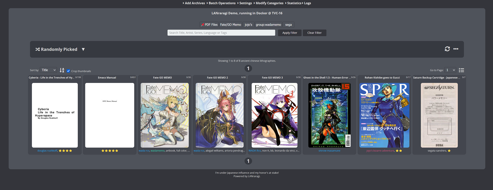
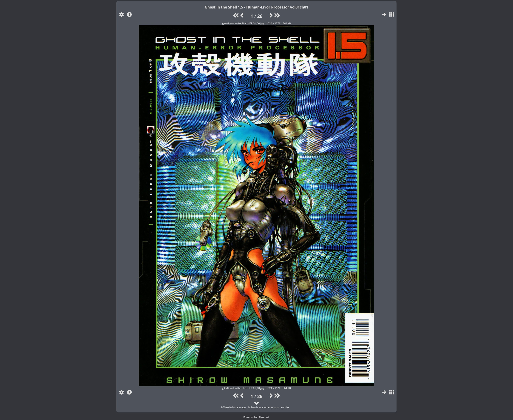
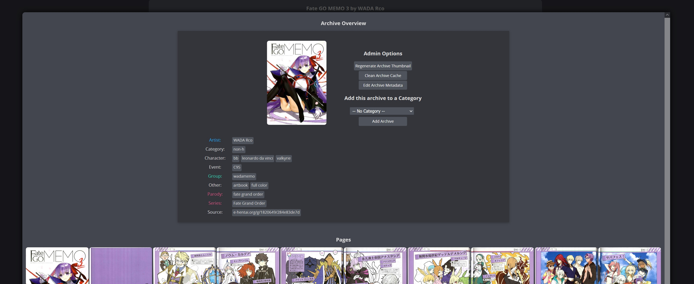
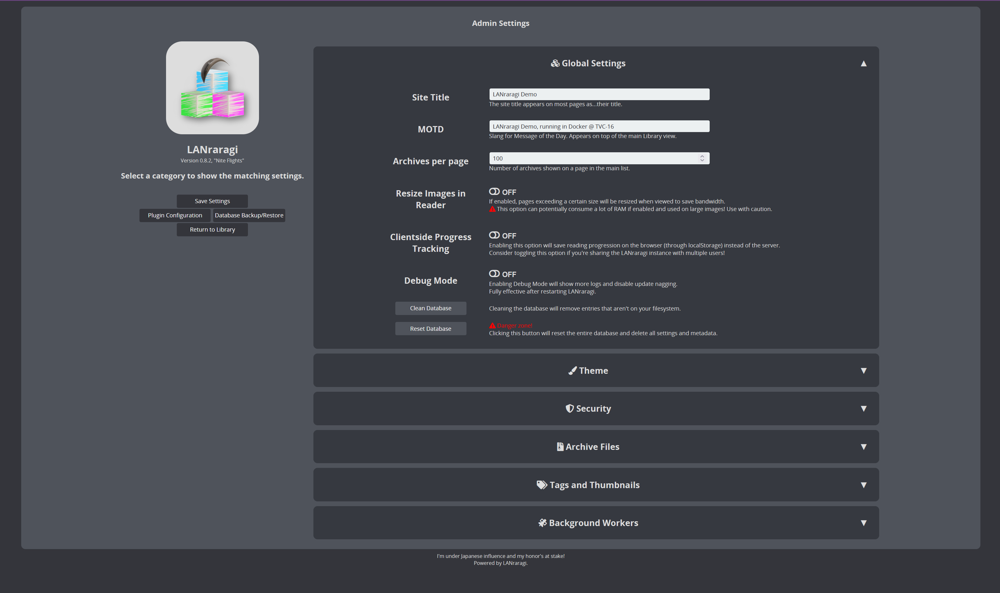
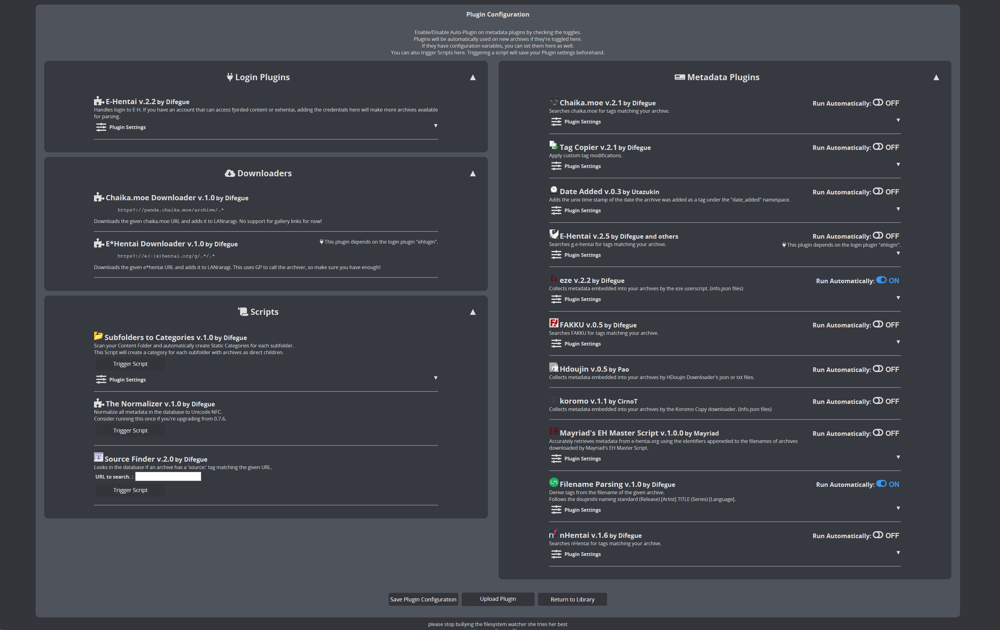

  

LANraragi_CN
===========
这是一个新的LANraragi简体中文汉化版本。  
基于当前最新LANraragi版本，重新翻译了所有文本，修正了一些翻译错误。

前两位汉化者都不更新了，旧版缺失了一些功能，故自己做了个最新版的。从头重新翻译了所有文本，修正了一些以前的翻译错误，翻译基于我自己的习惯和喜好进行润色，如果有某些地方不准确或有缺漏，欢迎提issues或者提交PR. 不保证更新速度，如果旧版没出什么问题，新版也没什么吸引我的新功能，那可能就不会更新。

Docker部分与先前的汉化项目保持一致，使用root账户代替koyomi解决群晖nas上面的无法访问挂载文件夹/home/koyomi/lanraragi/content目录的问题。  
如果你使用Docker安装，  
将漫画文件夹挂载到/root/lanraragi/content，  
将数据库挂载到/root/lanraragi/database，  
将缩略图文件夹挂载到/root/lanraragi/thumb，  
将插件文件夹挂载到/root/lanraragi/lib/LANraragi/Plugin/Sideloaded。

Docker用户将镜像切换到 yareiy/lanraragi_cn:latest 即可。  
注意！以防万一，请记得备份你的数据！

将不再内置ETagCN和ETagConverter插件，  
因为自上游v0.9.2(#980)开始侧载插件有了自己的VOLUME。  
在Docker中挂载插件文件夹/root/lanraragi/lib/LANraragi/Plugin/Sideloaded后即可在更新时不丢失插件。

如有需要，可自行下载并上传插件：  
[zhy201810576/ETagConverter](https://github.com/zhy201810576/ETagConverter)  
[zhy201810576/ETagCN](https://github.com/zhy201810576/ETagCN)

-------------------------------  
Open source server for archival of comics/manga, running on Mojolicious + Redis.

#### 💬 Talk with other fellow LANraragi Users on [Discord](https://discord.gg/aRQxtbg) or [GitHub Discussions](https://github.com/Difegue/LANraragi/discussions)  

####  [📄 Documentation](https://sugoi.gitbook.io/lanraragi/v/dev) | [⏬ Download](https://github.com/Difegue/LANraragi/releases/latest) | [🎞 Demo](https://lrr.tvc-16.science) | [🪟🌃 Windows Nightlies](https://nightly.link/Difegue/LANraragi/workflows/push-continous-delivery/dev) | [💵 Sponsor Development](https://ko-fi.com/T6T2UP5N)  

## Screenshots  
 
|Main Page, Thumbnail View | Main Page, List View |
|---|---|
|  |  |

|Archive Reader | Reader with overlay |
|---|---|
|  |  |

|Configuration | Plugin Configuration |
|---|---|
|  |  |

## Features  

* Stores your comics in archive format. (zip/rar/targz/lzma/7z/xz/cbz/cbr/pdf supported, barebones support for epub)  

* Read archives directly from your web browser: the server reads from within compressed files using temporary folders.

* Read your archives in dedicated reader software using the built-in OPDS Catalog (now with PSE support!)

* Use the Client API to interact with LANraragi from other programs (Available for [many platforms!](https://sugoi.gitbook.io/lanraragi/v/dev/advanced-usage/external-readers))

* Two different user interfaces : compact archive list with thumbnails-on-hover, or thumbnail view.

<<<<<<< HEAD
=======
* Localized interface with English, Chinese, and more to come.  

>>>>>>> upstream/master
* Choose from 5 preinstalled responsive library styles, or add your own with CSS.  

* Full Tag support with Namespaces: Add your own or import them from other sources using Plugins.  

<<<<<<< HEAD
* Store archives in either arbitary or dynamic Categories to sort your Library easily
=======
* Store archives in either arbitrary or dynamic Categories to sort your Library easily
>>>>>>> upstream/master

* Import metadata using Plugins automatically when archives are added to LANraragi.

* Download archives from the Internet directly to the server, while using the aforementioned automatic metadata import

* Backup your database as JSON to carry your tags over to another LANraragi instance.

## Make a PR, get stickers™  

Merged PRs to this repo(or $5+ donations) are eligible to get a dumb sticker pack [shipped on the house.](https://forms.office.com/Pages/ResponsePage.aspx?id=DQSIkWdsW0yxEjajBLZtrQAAAAAAAAAAAAN__osxt25URTdTUTVBVFRCTjlYWFJLMlEzRTJPUEhEVy4u)  
